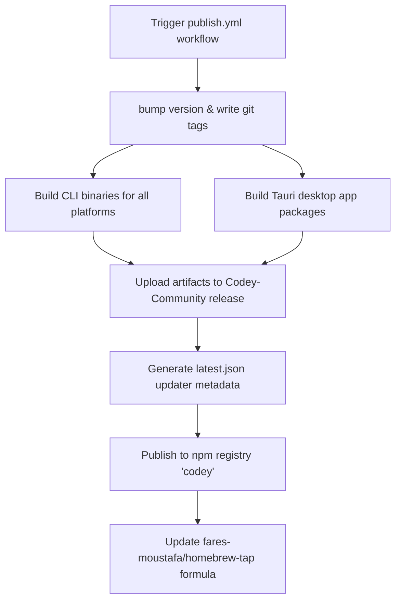

# 🚀 Release & Publishing Process

This document details how releases flow from the core development repository [**fares-moustafa/Codey**](https://github.com/fares-moustafa/Codey) to this distribution repository [**fares-moustafa/Codey-Community**](https://github.com/fares-moustafa/Codey-Community).

---

## 🗺️ Release Flow Overview

Releases are fully automated via GitHub Workflows in the core repository. 

---

## 🛠️ Step-by-Step Pipeline

### 1. Release Trigger
A release is triggered manually on the core repository's Actions tab via `publish.yml` using `workflow_dispatch` (with options for version overrides or major/minor/patch increments).

### 2. Compilation & Building
* **CLI Compilation**: The CLI builds for multiple platform architectures (`darwin-x64`, `darwin-arm64`, `linux-x64`, `linux-arm64` glibc & musl, `windows-x64`) and packages them as `.zip` or `.tar.gz`.
* **Tauri Desktop Build**: Multi-platform runners build:
  * **macOS (arm64 & Intel)** signed with Apple Code Sign Certificates.
  * **Windows (x64)** compiled as NSIS installer `.exe`.
  * **Linux (x86_64)** compiled as `AppImage` using custom portable bundles.

### 3. Distribution to Codey-Community
The build actions upload all compiled files directly to a GitHub Release draft on this repository (**Codey-Community**).
* CLI binaries are attached as `codey-<os>-<arch>.<ext>`.
* Desktop installers are attached as `Codey-desktop-<os>-<arch>.<ext>`.
* A Tauri `latest.json` description containing package signature, binary URL, and release notes is automatically written and attached to the release for auto-updater checks.

### 4. Registry Publishing
* **NPM Registry**: The platform-specific binary packages and the parent `codey` meta-package are packed and published on NPM.
* **Homebrew Tap**: The publish script calculates SHA256 hashes of the zipped CLI binaries, templates a Homebrew formula file `codey.rb`, and pushes the update to [**fares-moustafa/homebrew-tap**](https://github.com/fares-moustafa/homebrew-tap).

---

## 🔐 Configuration Secrets

The publishing pipeline requires the following secrets configured in the core repository:
* `RELEASE_REPO_TOKEN`: A Personal Access Token (PAT) with `repo` scope to create releases in `Codey-Community` and push commits to `homebrew-tap`.
* `NPM_TOKEN`: Authentic token to publish to NPM registry under the `codey` package namespace.
* `TAURI_SIGNING_PRIVATE_KEY` / `TAURI_SIGNING_PRIVATE_KEY_PASSWORD`: Key to sign desktop app installer binaries.
* `APPLE_CERTIFICATE` / `APPLE_CERTIFICATE_PASSWORD` / `APPLE_API_KEY`: Apple Developer credentials for macOS codesigning and app notarization.
